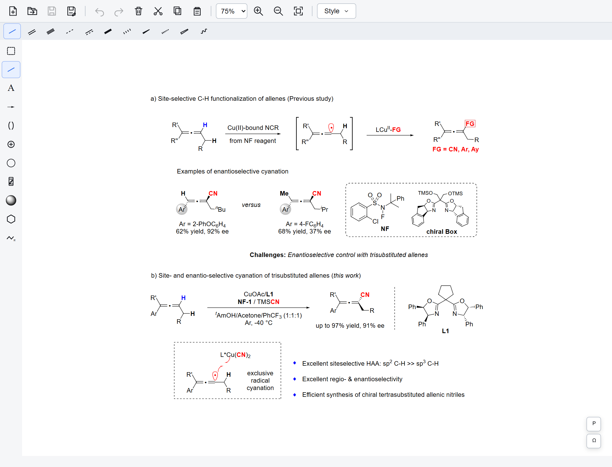
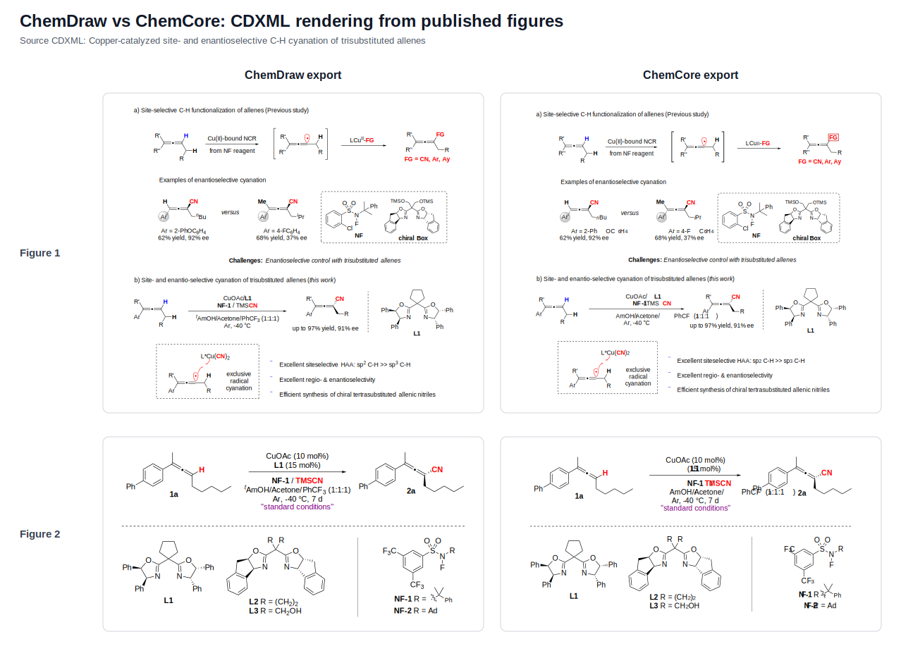
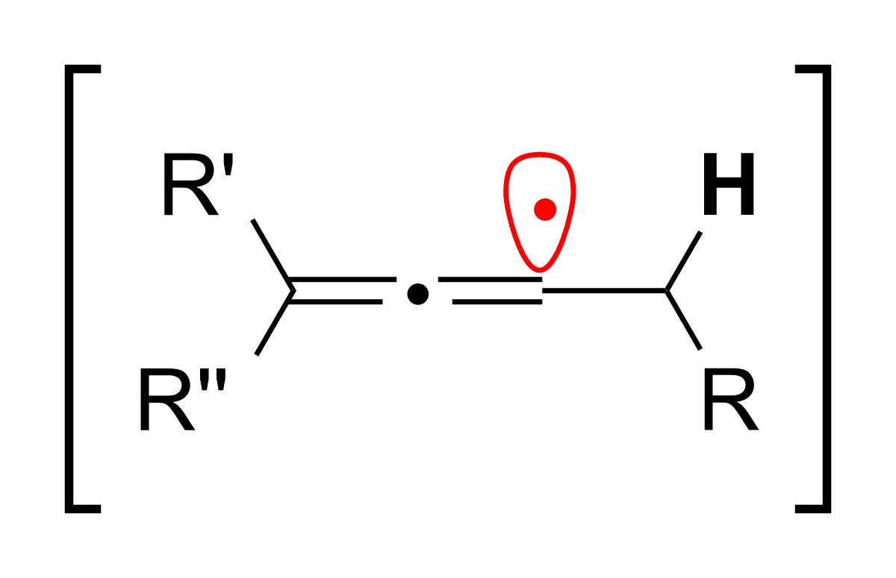
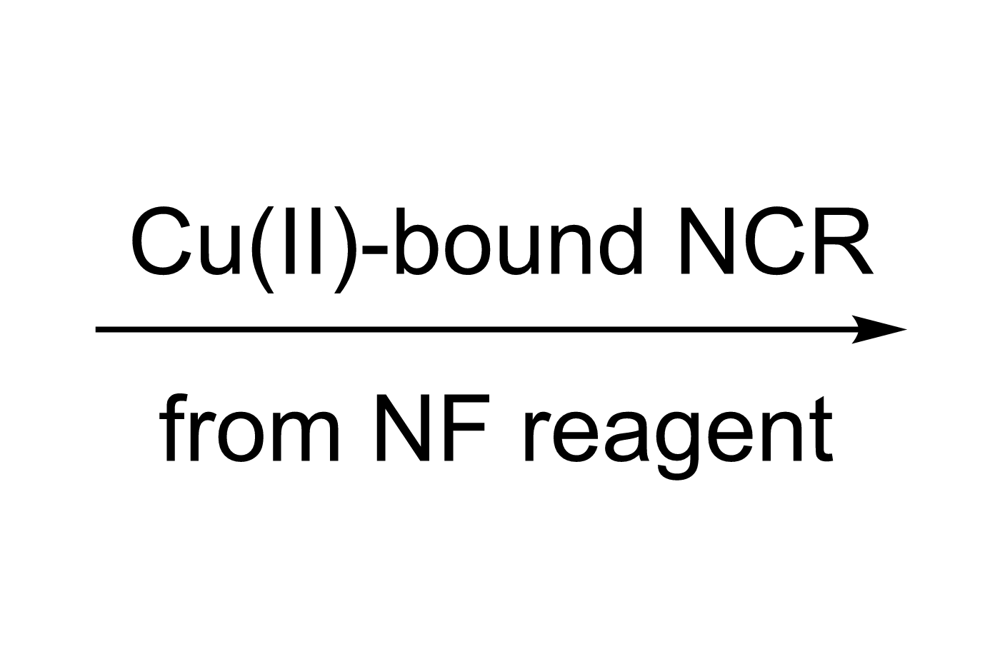
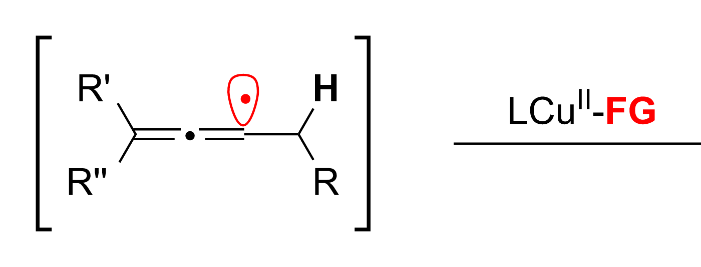

# ChemCore

[中文版](./README.zh-CN.md) | **English**

[](https://github.com/dreamlovesu32/chemcore/actions/workflows/ci.yml)
[](https://dreamlovesu32.github.io/chemcore/)
[](https://github.com/dreamlovesu32/chemcore/releases/download/v1.0.0-beta.5/Chemcore_1.0.0-beta.5_x64-setup.exe)
[](./LICENSE)
[](https://github.com/dreamlovesu32/chemcore/releases/tag/v1.0.0-beta.5)

ChemCore is an open-source chemistry structure editor built from scratch for everyday research drawing, publication layout, and Office copy/paste workflows at ChemDraw-level fidelity. Windows users can try the current beta with the [ChemCore 1.0.0-beta.5 x64 installer](https://github.com/dreamlovesu32/chemcore/releases/download/v1.0.0-beta.5/Chemcore_1.0.0-beta.5_x64-setup.exe). The installer includes the desktop app and the Windows Office/OLE integration service; it is not code-signed yet, so Windows may show a SmartScreen warning during this beta stage. It is a chemistry editor rather than a generic cheminformatics toolkit. Maintainer: Jiajun ZHANG, [dreamlovesu@hotmail.com](mailto:dreamlovesu@hotmail.com). Feedback, issues, real CDXML files, and contributions are very welcome. The long-term goal is to make ChemCore a free research infrastructure platform that can later grow into automation, batch processing, AI-assisted research interfaces, and more carefully designed scientific software.

The core architecture is a shared Rust engine with a lightweight Web interface and a headless CLI surface. Rust owns the document model, editing commands, hit testing, chemical label rules, implicit hydrogen logic, CDXML/CDX import/export, render primitive generation, and vector output needed by Office/OLE. The front end mainly collects events, manages UI state, and presents the result, so the visual editor can stay friendly to human researchers. The CLI calls the same engine directly for file inspection, format conversion, document generation, and JSON command execution, which gives scripts and agents a stable way to create, inspect, and modify documents without driving the GUI. Rust is used because this type of editor depends on long-lived geometry code, format parsers, and interaction state machines where memory safety, testability, performance, and typed boundaries matter. The same engine can compile to WASM for the browser and run as native code for the desktop shell, CLI, and Windows Office integration; the desktop app uses Tauri/WebView2, so the UI can remain Web-based while behavior stays centralized in the cross-platform core.



## Project History

ChemCore development started on April 23, 2026. The early development history is
published on the [`history/pre-public-release`](https://github.com/dreamlovesu32/chemcore/tree/history/pre-public-release)
branch so readers can follow how the project grew before the public release.

## Published Figure Comparison

The comparison below uses CDXML source files from a published paper by the
maintainer:

Jiajun ZHANG, Pinhong Chen,* Guosheng Liu*, Copper-Catalyzed Site- and
Enantioselective C–H Cyanation of Trisubstituted Allenes,
[Chin. J. Chem. 2026, 44, 1729–1734](https://onlinelibrary.wiley.com/doi/full/10.1002/cjoc.70531).

These real publication figures exercise molecule rendering, text layout,
reaction arrows, brackets, colors, radical/single-electron dots, graphical
objects, and Office-oriented vector output. The left column is exported by
ChemDraw; the right column is exported by ChemCore after importing the same
CDXML files.

These benchmark CDXML files were authored by the maintainer and are included
for reproducible rendering comparison.



The generated SVG and Office EMF vector files for both ChemDraw and ChemCore
are kept in [docs/assets/readme/comparison](./docs/assets/readme/comparison/),
and the README comparison image is regenerated from those refreshed assets.

The original CDXML files are tracked at the repository root:
[figure1.cdxml](./figure1.cdxml) and [figure2.cdxml](./figure2.cdxml).

## Agent-Oriented CLI

ChemCore also treats agents as first-class callers, not as scripts that have to
drive the GUI by guessing from screen pixels. The CLI is a deterministic engine
surface for machine workflows: it can discover stable selectors, return
object/bond/node ids, inspect raw object details, answer neighborhood queries,
create precise visual crops, execute JSON editing commands, and report what
changed after each operation.

The design goal is to give an agent both structure and pixels. Structured JSON
tells it which objects exist, where they are, how they relate through groups or
links, and whether a command created, updated, or deleted anything. Precise
PNG/SVG capture gives it a high-resolution visual view of the exact region it
is reasoning about. One-shot commands are convenient for isolated file tasks,
while JSONL `session` mode and CDXML import caching keep repeated work on large
documents fast. Output paths are verified after writing, and command errors
include recoverable usage hints instead of bare failure codes.

Precise capture is one visible part of that interface. It crops the same visual
region a GUI selection box would cover: the requested object or multi-selection
defines the frame, while everything visible inside that frame is rendered into
the PNG/SVG. Context queries use the same target model and return the
surrounding objects with ids, directions, distances, `inside`/`partial`
selection-box membership, group ancestry, and link metadata.

Examples generated from the public [figure1.cdxml](./figure1.cdxml) fixture:

| Exact object crop | Context crop around an arrow object | Multi-target selection crop |
| --- | --- | --- |
|  |  |  |

The context command that produced the middle image also returns structured ids
for the same region. For example, around `object:obj_line_001` it reports the
target arrow itself, the partly overlapping molecule
`object:obj_cdxml_merged_molecule`, the partly overlapping condition text
`object:obj_text_008`, and the nearby lower text `object:obj_text_025`.

```bash
chemcore-cli guide
chemcore-cli targets figure1.cdxml --pretty
chemcore-cli detail figure1.cdxml --target object:obj_bracket_001 --pretty
chemcore-cli context figure1.cdxml --target object:obj_line_001 --radius 45 --expand-left 10 --expand-right 10 --expand-top 34 --expand-bottom 34 --capture-out tmp/line-context.png --out tmp/line-context.json --pretty
chemcore-cli capture figure1.cdxml --target object:obj_bracket_001 --out tmp/bracket.png --width 1200 --expand 8 --pretty
```

## Current Status

Current version: `1.0.0-beta.5`.

The Windows x64 installer is available from the
[v1.0.0-beta.5 release](https://github.com/dreamlovesu32/chemcore/releases/tag/v1.0.0-beta.5).
It bundles the Tauri/WebView2 desktop app, file associations, and the
Office/OLE integration service. The installer is still a beta build and is not
code-signed yet. The browser demo is published through GitHub Pages:
<https://dreamlovesu32.github.io/chemcore/>.

## Product Highlights

- **Built for real research drawing workflows**: ChemCore is designed around drawing structures, arranging reaction schemes, copying into Word or PowerPoint, and returning later for editing.
- **ChemDraw-compatible files and layout habits**: CDXML/CDX import and export are first-class paths, with source structure, text, arrows, brackets, symbols, colors, and object positions preserved as much as possible.
- **One shared core for browser, desktop, and Office integration**: Editing rules, hit testing, chemical labels, render primitives, and import/export logic live in the Rust engine to avoid behavior drift between surfaces.
- **Low-latency editing**: Hover, focus, selection, drag preview, rotation, and zoom use local WASM/Rust hot paths.
- **Modern desktop behavior**: The Tauri/WebView2 desktop shell supports file open/save, drag-to-open, recent files, tabs, unsaved-change prompts, shortcuts, and Windows file association.
- **Office paste and embedding are treated seriously**: Copy operations consider native ChemCore data, CDXML, SVG, EMF, RTF/OOXML, and OLE payloads so Office display and later editing remain reliable.
- **Agent-oriented headless CLI**: The CLI can inspect documents, convert formats, query object ids and relationships, create exact PNG/SVG crops, execute JSON editing commands with audit reports, and reuse large documents through cache/session workflows.

## Implemented Capabilities

- **CDXML/CDX import and export**: The Rust engine parses and writes ChemDraw-oriented formats, maps them into the ChemCore document model, and keeps enough drawing information for re-rendering and round trips.
- **Unified document and rendering model**: The document model, runtime scene, hit testing, selection state, and render primitives are defined in the engine while the front end focuses on events and display.
- **Complex bond geometry**: Single, double, triple, bold, dashed, solid wedge, hashed wedge, label clipping, bond joins, crossing gaps, and ChemDraw-style template parameters are implemented.
- **Arrows and graphical objects**: Reaction arrows, equilibrium arrows, hollow arrows, curved arrows, brackets, lines, shapes, and symbols are supported and continue to be aligned with ChemDraw interaction details.
- **Selection, drag, rotation, and arrangement**: Object-level and partial molecule selection, multi-select drag preview, rotation, flip, alignment, distribution, color application, and undoable command history are available.
- **Text and label editing**: Free text, endpoint element replacement, label editing, text selection, style synchronization, and the behavioral distinction between chemical labels and free text are handled.
- **Implicit hydrogen and element rules**: Main-group auto-hydrogen logic, valence counting, charge effects, and period-specific rules are centralized in the engine.
- **Abbreviation and group recognition**: Common abbreviations such as Me, Et, Ph, CN, NO2, Boc, Ts, TMS, TBDMS, and TBDPS are recognized and treated as groups during flipping, formula, and mass calculations.
- **Formula and mass statistics**: Selected structures can report formula weight, exact mass, and expanded abbreviation composition.
- **Desktop and Office foundations**: Browser, desktop, and Office/OLE boundaries are established, including Windows clipboard, EMF preview, and Word OOXML/OLE payload paths.

## Design Details

ChemCore focuses on the small details that decide whether a chemistry editor is
pleasant enough for real daily use. These rules live in the shared Rust engine
where possible, so the browser, desktop shell, SVG/EMF output, and Office paths
consume the same geometry.

### Text Clipping

Endpoint labels are split into styled runs and line runs, then the engine builds per-glyph clip
polygons from font size, baseline, subscript/superscript shifts, and character
advance data. When a bond is rendered, its endpoint ray intersects the glyph
polygon edges, picks the farthest exit point from the atom, and advances by the
bond's `label_clip_margin`. The default template uses `1.2pt`; ACS Document
1996 uses `0.8pt`.

Common uppercase letters and symbols use tuned height-centered glyph polygons
generated from Arial, including cases such as `N`, `I`, and `+`. Unknown
uppercase letters fall back to conservative uppercase profiles, and full-width
or CJK characters use square profiles. If a document has no glyph polygons, the
engine falls back to the label bounding box.

### Label Grouping

Chemical labels are grouped by uppercase-led fragments and known abbreviations.
For example, `OTMS` is grouped as `O` + `TMS`, so a right-side label becomes
`TMSO`. Anchors are assigned to
the chemically meaningful terminal letter.

### Bond Joins

Shared endpoints are computed as real polygons. Each bond endpoint is converted
into an axis, normal, left/right contour lines, and half width. For two-bond
joins, the engine intersects inner-inner and outer-outer contours and stores
endpoint profiles for each bond. For three or more incident bonds, contours are
sorted by polar angle and only adjacent pairs are intersected, producing a ring
of profiles around the node. Sharp angles are limited by a miter cap.

### Crossing Gaps

Non-endpoint crossings use a separate knockout pass. Within a molecule
fragment, bonds are rendered in order and later bonds are treated as the upper
layer. Before drawing an upper bond, the engine checks it against already drawn
lower bonds, skips shared endpoints and near-parallel cases, and inserts a
white knockout polygon at true interior intersections. The gap length is
compensated by the crossing angle's sine, and the width uses the upper bond's
visual width plus its template `marginWidth`.

### Infinite Canvas

The editor uses a runtime `viewBox`.
The SVG `viewBox` is expressed in document-world coordinates, while CSS size is
computed from `pt -> css px -> zoom`; the scroll container is just a window into
that world. Empty documents start with a centered buffer around the visible
area. After each render, document bounds are compared with the current viewBox;
if content approaches an edge, the viewBox expands in that direction and
left/top expansions compensate scroll delta so the scene remains visually stable.

### Stable Interaction

Selection boxes, hover state, drag previews, rotation handles, curved-arrow
handles, text boxes, and graphical objects are kept stable in dense CDXML
documents. Selected content suppresses internal hover, drag previews follow
locally before committing to the engine, and each desktop tab preserves its
document, zoom, and runtime view state.

Architecturally, ChemCore keeps the rules that affect consistency inside the
engine wherever possible: hit testing, selection ranges, hover behavior,
drawing geometry, text clipping, bond joins, implicit hydrogen, abbreviation
recognition, CDXML parsing, and export rendering are shared by the browser,
desktop, and Office paths.

Complex CDXML compatibility, Office copy/paste, OLE embedding, and ChemDraw
format fidelity are still being actively refined. Reports with concrete files,
screenshots, or real Office workflows are especially useful.

## Welcome

If you use ChemDraw heavily, care about free research infrastructure, or are
interested in AI-assisted scientific software development, you are very welcome
to try ChemCore, open issues, join discussions, or contribute code.

The most useful feedback usually comes in two forms: concrete files with
screenshots that help align ChemDraw display and interaction, and real writing
workflows that expose copy/paste, Office editing, layout, or export problems.
ChemCore is built to become a tool that can enter daily research work.

Please contact the maintainer using the email address at the top of this README.

## Repository Layout

```text
chemcore/
  crates/chemcore-engine/          Rust document, editing, rendering, CDXML, and WASM core
  crates/chemcore-cli/             Headless file inspection, conversion, export, and command runner
  crates/chemcore-desktop-service/ Native desktop engine sessions and file helpers
  apps/chemcore-desktop/           Tauri Windows desktop application
  apps/chemcore-office/            Windows Office/OLE integration server
  viewer/                          Browser editor host and generated WASM package
  docs/                            Public rules, specs, architecture notes, and assets
  examples/                        Example ChemCore native documents
  fixtures/                        Public synthetic CDXML regression fixtures
  scripts/                         Build, verification, and regression helpers
  shared/                          Shared JSON data consumed by Rust and viewer code
```

## Prerequisites

- Rust stable with the MSVC toolchain on Windows
- Node.js and npm
- Python 3 for local static serving and some optional analysis scripts
- `wasm-pack` is installed automatically by `npm run build:engine-wasm` when needed
- Windows is required for the desktop shell and Office/OLE integration paths

## Quick Start

```bash
npm install
cargo test
npm run build:engine-wasm
```

Run the browser editor from the repository root:

```bash
python -m http.server 8765 --bind 127.0.0.1 --directory .
```

Then open:

```text
http://127.0.0.1:8765/viewer/
```

Run the Windows desktop shell:

```bash
npm run desktop:dev
```

Run the headless file CLI:

```bash
npm run cli -- inspect figure1.cdxml --pretty
npm run cli -- convert figure1.cdxml tmp/figure1.svg
npm run cli -- targets figure1.cdxml --pretty
npm run cli -- capture figure1.cdxml --target object:obj_bracket_001 --out tmp/bracket.png --width 1200 --expand 8 --pretty
npm run cli -- context figure1.cdxml --target object:obj_line_001 --radius 45 --expand-left 10 --expand-right 10 --expand-top 34 --expand-bottom 34 --capture-out tmp/line-context.png --out tmp/line-context.json --pretty
npm run cli -- new commands.json --out generated.cdxml --results results.json --pretty
npm run cli -- run input.cdxml commands.json --out edited.cdxml --results results.json --document-json after.ccjs --pretty
```

Build release binaries:

```bash
npm run desktop:build-fast
cargo build -p chemcore-office --release
```

Register the Office/OLE integration for the current user:

```bash
npm run office:register-dev
```

Unregister it:

```bash
npm run office:unregister-dev
```

## Verification

The main verification command is:

```bash
npm run verify
```

It runs Rust tests, rebuilds the browser engine WASM, checks viewer JavaScript
syntax, and verifies that generated `viewer/engine` files are synchronized.

Useful focused commands:

```bash
npm test
cargo test -p chemcore-engine
cargo test -p chemcore-office
cargo test -p chemcore-engine public_cdxml_fixture_svg_golden_snapshots_match --test render_document
npm run build:engine-wasm
node --check viewer/app.js
```

Public synthetic CDXML fixtures live in [fixtures/cdxml](./fixtures/cdxml/),
with matching golden SVG snapshots in
[fixtures/expected/svg](./fixtures/expected/svg/). The comparison and snapshot
workflow is documented in [Rendering Comparison And Regression Assets](./docs/rendering-comparison.md).

Some scripts compare output against locally installed desktop applications or
Office. Those flows are optional and may require Windows-specific software,
local documents, or `CHEMCORE_PYTHON` to point at a Python environment with the
needed analysis packages.

## Design Documents

- Abbreviation recognition rules: [English](./docs/abbreviation-recognition-rules.md) / [中文](./docs/abbreviation-recognition-rules.zh-CN.md)
- Architecture overview: [English](./docs/architecture.md) / [中文](./docs/architecture.zh-CN.md)
- Bond rendering rules: [English](./docs/bond-rendering-rules.md) / [中文](./docs/bond-rendering-rules.zh-CN.md)
- Charge and radical symbol rules: [English](./docs/charge-radical-symbol-rules.md) / [中文](./docs/charge-radical-symbol-rules.zh-CN.md)
- ChemCore CLI command guide: [English](./docs/chemcore-cli-guide.md) / [中文](./docs/chemcore-cli-guide.zh-CN.md)
- Document commit contract: [English](./docs/document-commit-contract.md) / [中文](./docs/document-commit-contract.zh-CN.md)
- Editor command history: [English](./docs/editor-command-history.md) / [中文](./docs/editor-command-history.zh-CN.md)
- Format v0.1: [English](./docs/format-v0.1.md) / [中文](./docs/format-v0.1.zh-CN.md)
- Glyph clipping rules: [English](./docs/glyph-clip-polygons.md) / [中文](./docs/glyph-clip-polygons.zh-CN.md)
- Glyph kernel: [English](./docs/glyph-kernel.md) / [中文](./docs/glyph-kernel.zh-CN.md)
- Implicit hydrogen rules: [English](./docs/implicit-hydrogen-rules.md) / [中文](./docs/implicit-hydrogen-rules.zh-CN.md)
- Project rules: [English](./docs/project-rules.md) / [中文](./docs/project-rules.zh-CN.md)
- Rendering comparison and regression assets: [English](./docs/rendering-comparison.md) / [中文](./docs/rendering-comparison.zh-CN.md)
- Rust engine architecture: [English](./docs/rust-engine-architecture.md) / [中文](./docs/rust-engine-architecture.zh-CN.md)
- Text symbols and glyph profiles: [English](./docs/text-symbol-glyph-profile-rules.md) / [中文](./docs/text-symbol-glyph-profile-rules.zh-CN.md)
- Valence-driven label recognition: [English](./docs/valence-label-recognition-rules.md) / [中文](./docs/valence-label-recognition-rules.zh-CN.md)
- Windows desktop and Office architecture: [English](./docs/windows-desktop-office-architecture.md) / [中文](./docs/windows-desktop-office-architecture.zh-CN.md)
- Release notes: [CHANGELOG.md](./CHANGELOG.md) / [中文](./CHANGELOG.zh-CN.md)
- Roadmap: [English](./ROADMAP.md) / [中文](./ROADMAP.zh-CN.md)
- [THIRD_PARTY_NOTICES.md](./THIRD_PARTY_NOTICES.md)

## License

ChemCore is licensed under the Apache License, Version 2.0. See
[LICENSE](./LICENSE) and [NOTICE](./NOTICE).
