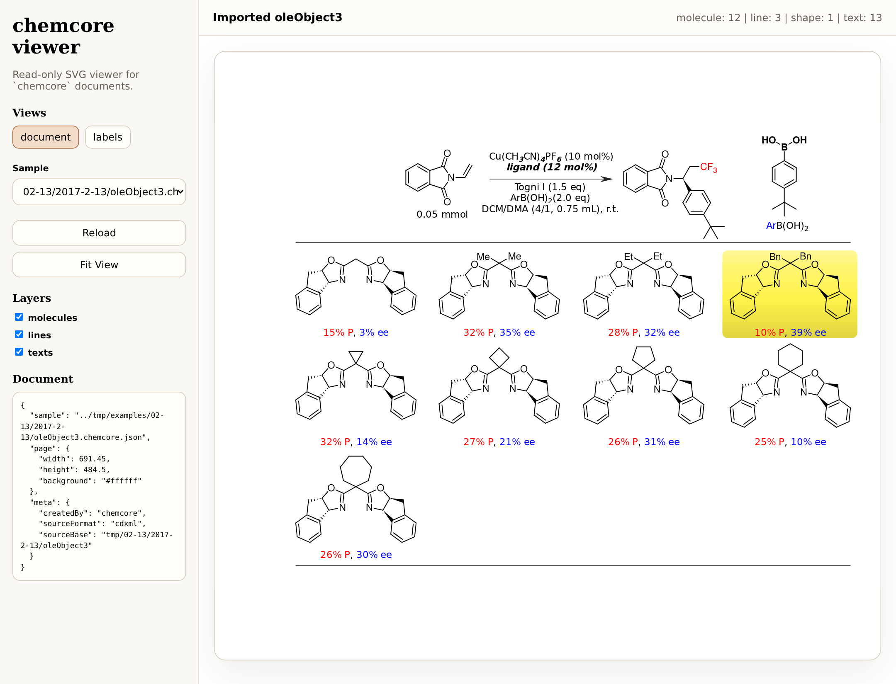
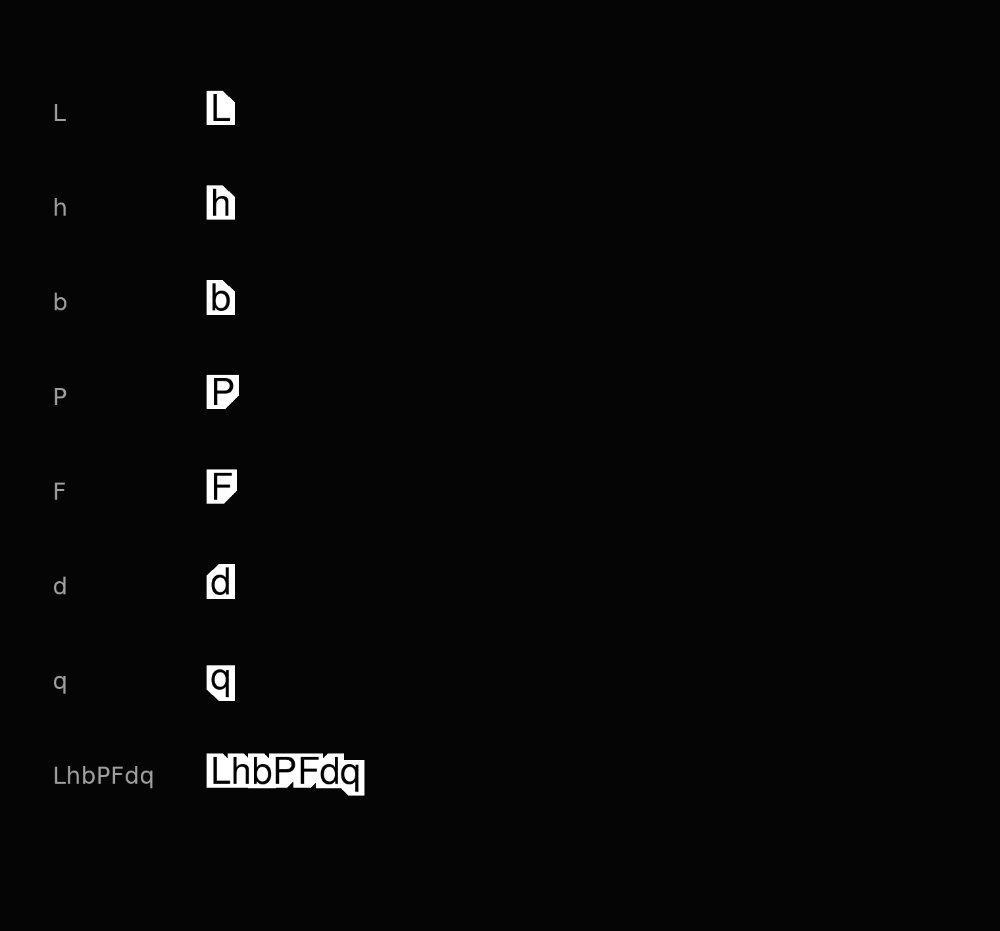
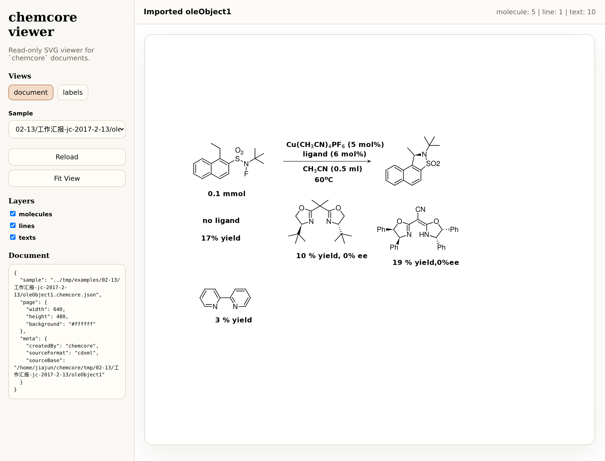

# Viewer 渲染效果与实现说明

这份文档记录当前 `chemcore` viewer 的整体渲染状态，以及最近一轮为 ChemDraw/CDXML 兼容性补上的关键细节。当前 viewer 仍是只读渲染器，但已经覆盖了化学文档中最容易暴露问题的几类内容：富文本标签、上下标、加粗样式、逐字形避让、楔形键、虚楔形键、偏置双键、文本遮罩和 CDXML 页面布局。

## 整体效果



当前 viewer 以 `chemcore` 文档 JSON 为输入，把 CDXML 导入结果渲染为 SVG。示例页中包含：

- 反应方案、箭头、条件文本和结果表格
- 多个分子对象、芳环、双键、虚楔形键、实楔形键
- 颜色文本、加粗文本、斜体文本、上下标文本
- 带标签原子和无标签碳骨架的混合结构

渲染链路分成两类对象：

- `molecule_fragment2d`：从 CDXML fragment 直接保留节点、键、标签和显示属性，由 viewer 按对象几何绘制。
- legacy molblock：从 molblock2d 解析原子/键，再映射到对象 bbox 中绘制。

## 标签与字形避让



viewer 的化学标签不是简单按一个整块文本 bbox 避让。当前做法是：

- C++ glyph kernel 输出每个 glyph 的 advance、ink box、background box 和 optical shape。
- viewer 用每个字符的 optical shape 做键线 retreat、label knockout 和碰撞判断。
- 前台 SVG `<text>` 仍负责真实文字绘制，但字体族和 C++ profile 使用同一参考字体族优先级，减少宽度不一致。

特殊字形目前有两类 shape：

- `rect` / `ellipse`：基础矩形或椭圆近似。
- cut-corner rect：只对明确需要的字符削角。

当前削角规则保持很窄：

- `L/h/b`：右上角削
- `P/F`：右下角削
- `d`：左上角削
- `q`：左下角削

这样可以减少键线被空白字形区域过度推开的情况，同时避免把 `r/t/k/A/W` 等字符过度泛化。

## 富文本、上下标与加粗

CDXML 的 `face` 位同时携带样式和上下标信息。viewer 侧按这些位渲染：

- `face & 1`：bold
- `face & 2`：italic
- `face & 32`：subscript
- `face & 64`：superscript

转换阶段现在会处理一个常见 CDXML 问题：上下标 run 可能只有 `32/64`，丢掉相邻文本的 bold/italic 位。导入器会在同一组 runs 中为这类 script-only run 继承相邻样式位。例如加粗的 `Cu(CH3CN)4PF6` 中，`3/4/6` 会变成 `face=33`，即 bold + subscript。

这保证了：

- 加粗文本中的上下标继续加粗
- 上下标的字号和基线移动仍由 glyph kernel 控制
- 非加粗文本中的普通上下标不被误加粗

## 实楔形键接触处理


实楔形键宽端和其它键接触时，不能总是画成对称三角形。当前规则只作用于宽端没有标签的节点；如果宽端有原子标签或文本标签，则保留 label 避让逻辑，不做接触变形。

接触候选包括：

- 普通单键
- 偏置双键的主键

不包括：

- 居中等长双键
- 其它 stereo bond
- 宽端有可见标签的情况

单接触时：

- 楔形键两条边分别与接触键的远侧边线求交。
- 结果仍是三点填充面，但宽端两个点都来自几何交点，不再使用简单对称 cap。

双接触时：

- 楔形键中线连到宽端节点。
- 两侧边分别与两根接触键的远侧边线求交。
- 结果是四点填充面：窄端、第一交点、宽端中心、第二交点。

远侧边线是相对楔形内部的另一侧，略越过键中心线，使黑色填充面和接触键之间没有白缝。

## 标签保护



楔形键接触变形只针对无标签节点。带标签节点的优先级是文字可读性和 label knockout：

- molblock 中非 `C` 原子标签阻止宽端接触变形。
- fragment 中 node 有可见 `label.text` 或 `inputText` 时阻止宽端接触变形。
- 键线仍会按标签 optical shape retreat，避免穿过文字。

这避免了 `TsN`、`CF3`、`B(OH)2` 等标签附近的楔形键被相邻键拉伸到文字区域。

## 关键实现位置

- CDXML 到文档模型转换：[src/chemcore/convert/cdxml_to_document.py](../src/chemcore/convert/cdxml_to_document.py)
- CDXML fragment 标签提取：[src/chemcore/cdxml/cdxml_fragment_display.py](../src/chemcore/cdxml/cdxml_fragment_display.py)
- C++ glyph kernel：[cpp/chemcore_glyph_kernel/src/glyph_kernel.cpp](../cpp/chemcore_glyph_kernel/src/glyph_kernel.cpp)
- C ABI / WASM 输出：[cpp/chemcore_glyph_kernel/src/glyph_kernel_c_api.cpp](../cpp/chemcore_glyph_kernel/src/glyph_kernel_c_api.cpp)
- Rust core render：[../crates/chemcore-engine/src/render.rs](../crates/chemcore-engine/src/render.rs)
- viewer SVG 壳层：[viewer/app.js](../viewer/app.js)
- glyph reference/preview 工具：[scripts/glyph_kernel_reference.py](../scripts/glyph_kernel_reference.py)

## 验证方式

常用验证命令：

```bash
python3 -m py_compile src/chemcore/convert/cdxml_to_document.py
node --check viewer/app.js
cargo test -p chemcore-engine
cmake --build build --target chemcore_glyph_kernel_smoke
./build/cpp/chemcore_glyph_kernel/chemcore_glyph_kernel_smoke
npm run build:glyph-wasm
```

viewer 截图可用：

```bash
node scripts/viewer-screenshot.mjs \
  http://127.0.0.1:8765/viewer/ \
  tmp/viewer-screenshot.png \
  ../tmp/examples/02-13/2017-2-13/oleObject3.chemcore.json
```

当前 viewer 服务可以直接加载 `tmp/examples/02-13` 下的示例 JSON，刷新页面即可看到最新 WASM 和前台逻辑。
